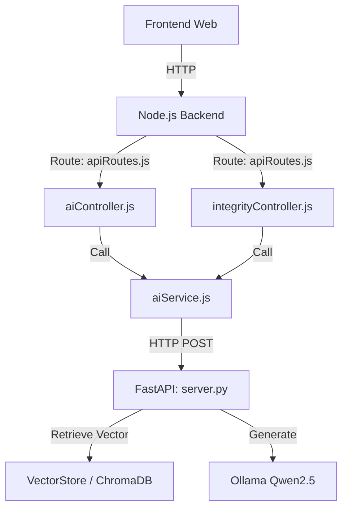

# Walkthrough: Integrasi Dinamis VerifyLearn (Web Backend & AI/ML)

Dokumen ini mendokumentasikan seluruh perubahan yang telah dilakukan pada repositori **VerifyLearn** untuk menghubungkan Node.js Backend dengan Python AI (ML) Service secara dinamis, serta cara kerja detail dari masing-masing komponen.

---

## Ringkasan Perubahan

Berikut adalah daftar file yang telah dimodifikasi dan dibuat:



### 1. Python AI Service (ML)
*   **[NEW] [server.py](file:///d:/Lomba/VerifyLearn/python_ai/server.py)**
    *   Membungkus seluruh logika `RAGEngine` (Kuis, Livecode, Voice Challenge, Final Challenge) ke dalam web API server berbasis **FastAPI**.
    *   Mengimplementasikan **Algoritma Verifikasi Keystroke (Keystroke Dynamics)** secara statistik (tanpa memerlukan dependensi eksternal yang lambat).
*   **[MODIFY] [engine.py](file:///d:/Lomba/VerifyLearn/python_ai/services/rag/engine.py)**
    *   Mengubah inisialisasi model LLM (`LLM_MODEL`) agar membaca dari environment variable `OLLAMA_MODEL` (dengan fallback `qwen2.5:latest`) sehingga model dapat diganti dengan fleksibel (misal ke `gemma2` atau `llama3`) tanpa menyentuh kode.
*   **[MODIFY] [Dockerfile](file:///d:/Lomba/VerifyLearn/python_ai/Dockerfile)**
    *   Mengubah perintah running container (`CMD`) agar otomatis menjalankan server FastAPI dengan uvicorn (`uvicorn server:app`).

### 2. Node.js Backend
*   **[MODIFY] [aiService.js](file:///d:/Lomba/VerifyLearn/backend/src/services/aiService.js)**
    *   Menghubungkan fungsi-fungsi backend ke server FastAPI Python melalui pemanggilan HTTP `fetch` ke `AI_SERVICE_URL`.
*   **[NEW] [aiController.js](file:///d:/Lomba/VerifyLearn/backend/src/controllers/aiController.js)**
    *   Membuat controller baru untuk menangani pembuatan kuis, livecode, voice challenge, dan final challenge secara dinamis.
    *   **Fitur Otomatisasi Modul:** Jika frontend hanya mengirimkan parameter `role` dan `slug` materi, controller akan otomatis mencari konten lengkap materi tersebut di file JSONL lokal dan meneruskannya ke Python AI.
*   **[MODIFY] [integrityController.js](file:///d:/Lomba/VerifyLearn/backend/src/controllers/integrityController.js)**
    *   Menyambungkan endpoint verifikasi ketikan `/verify-keystroke` ke fungsi analitik riil di `aiService.js` (tidak lagi menggunakan mock data statis).
*   **[MODIFY] [apiRoutes.js](file:///d:/Lomba/VerifyLearn/backend/src/routes/apiRoutes.js)**
    *   Mendaftarkan empat rute POST baru untuk pembuatan konten dinamis AI.

### 3. Docker Compose
*   **[MODIFY] [docker-compose.yml](file:///d:/Lomba/VerifyLearn/docker-compose.yml)**
    *   Menghapus override `command: tail -f /dev/null` pada container `python_ai` agar ia otomatis mengeksekusi FastAPI server.

---

## Penjelasan Detil Cara Kerja Sistem ML & Keystroke Ke Teman Anda

Saat Anda menjelaskan perubahan ini ke teman Anda yang menangani bagian ML, berikut adalah poin-poin penting yang bisa disampaikan:

### A. Server FastAPI & RAGEngine
FastAPI bertindak sebagai jembatan agar backend Node.js bisa memanggil kelas `RAGEngine` buatan teman Anda. Saat sebuah request masuk (misal untuk kuis), FastAPI menerima data materi, memanggil `RAGEngine.generate_quiz()`, melakukan serialisasi dataclass Python menjadi JSON murni menggunakan `asdict`, dan mengirimkannya kembali ke Node.js.

### B. Algoritma Analisis Keystroke Dynamics
Kita menerapkan algoritma heuristik statistik di berkas [server.py](file:///d:/Lomba/VerifyLearn/python_ai/server.py#L60) untuk membedakan ketikan manusia normal dengan bot atau aksi copy-paste:
1.  **Dwell Time (Durasi Menekan Tombol):**
    Menghitung selisih waktu antara peristiwa `keydown` (tombol ditekan) dan `keyup` (tombol dilepas) untuk tombol yang sama. Rata-rata dwell time manusia umumnya berkisar antara 50ms hingga 150ms.
2.  **Flight Time / Rhythm (Konsistensi Jeda):**
    Mengukur waktu antar ketukan tombol berturut-turut. Kita menghitung **standar deviasi** dari jeda ini. Jika standar deviasi sangat kecil (< 4.0ms), itu mengindikasikan ketikan mesin (bot) yang ritmenya terlalu presisi dan sempurna.
3.  **WPM (Words Per Minute):**
    Menghitung total karakter yang diketik dibagi dengan total waktu. Jika WPM di atas 220, sistem menganggapnya tidak wajar untuk manusia biasa yang sedang belajar/mengetik manual.
4.  **Instant Ratio (Copy-Paste Detector):**
    Menghitung rasio karakter yang diinput dalam waktu kurang dari 5 milidetik secara berturut-turut. Jika rasio ini > 25% dari total input, maka sistem mendeteksi aksi copy-paste masif.

---

## Panduan Pengujian Mandiri (Saat Teman Anda & Ollama Aktif)

Untuk menjalankan dan memverifikasi sistem ini secara lokal di kemudian hari:

### Langkah 1: Jalankan Ollama di Laptop Teman
Teman Anda harus membuka port akses luar pada Ollama-nya:
```powershell
$env:OLLAMA_HOST="0.0.0.0"
ollama serve
```
Dan pastikan model Qwen2.5 sudah terunduh:
```bash
ollama pull qwen2.5:latest
```

### Langkah 2: Jalankan Docker Compose di Laptop Anda
Dapatkan IP Jaringan Lokal (LAN) dari laptop teman Anda (misal: `192.168.1.50`). Jalankan di terminal laptop Anda:
```powershell
$env:OLLAMA_HOST="http://192.168.1.50:11434"
docker-compose up --build -d
```

### Langkah 3: Tes Endpoint Verifikasi Keystroke (Manual via cURL)
Buka terminal dan jalankan perintah cURL berikut ke server Node.js Anda (Port 3000):
```bash
curl -X POST http://localhost:3000/api/v1/verify-keystroke \
  -H "Content-Type: application/json" \
  -d '{
    "keystrokes": [
      {"key": "H", "time": 1718000000000, "type": "keydown"},
      {"key": "H", "time": 1718000000080, "type": "keyup"},
      {"key": "e", "time": 1718000000150, "type": "keydown"},
      {"key": "e", "time": 1718000000220, "type": "keyup"},
      {"key": "l", "time": 1718000000300, "type": "keydown"},
      {"key": "l", "time": 1718000000390, "type": "keyup"},
      {"key": "l", "time": 1718000000450, "type": "keydown"},
      {"key": "l", "time": 1718000000520, "type": "keyup"},
      {"key": "o", "time": 1718000000600, "type": "keydown"},
      {"key": "o", "time": 1718000000680, "type": "keyup"}
    ]
  }'
```
*   **Hasil Diharapkan:** `{ "verified": true, "confidence": 1.0, "message": "Pola ketikan terverifikasi aman.", "metrics": { ... } }`

### Langkah 4: Tes Generate Kuis Dinamis
Jalankan perintah cURL berikut untuk membuat kuis pada modul Express:
```bash
curl -X POST http://localhost:3000/api/v1/generate-quiz \
  -H "Content-Type: application/json" \
  -d '{
    "role": "backend",
    "slug": "express-js",
    "n_pg": 2,
    "n_essay": 1
  }'
```
*   **Hasil Diharapkan:** Server akan memicu LLM di laptop teman Anda via FastAPI dan mengembalikan JSON berisi daftar pertanyaan pilihan ganda dan esai yang dinamis.
